<script type="text/javascript" src="https://unpkg.com/mermaid@8.0.0-rc.8/dist/mermaid.min.js"></script>
<script>$(document).ready(function() {mermaid.initialize({theme: 'forest'});});</script>

Smart Route Design (GIS System)
================================


The following technologies are being used:
- PostGIS - <a href="https://postgis.net/" target="_blank">https://postgis.net/</a> mapping and GIS system built in SQL
- Open Steet Maps - <a href="https://nominatim.openstreetmap.org/ui/search.html" target="_blank">https://nominatim.openstreetmap.org/ui/search.html</a> - OSM mapping data is imported into SQL. It includes map data, polygons, geographic features like roads and water, and geography/polygon math
- <a href="https://osm2pgsql.org/" target="_blank">https://osm2pgsql.org/</a> - Used to import Open Street Maps data into Postgres for your region (for example a 5GB dataset for Kenya)

PlastiPoint Data 
---------------
Latitude, Longitude and a PickupRequestId are copied to Postgres from the backend so we can run GIS logic to build efficient maps and model the best route for the collectors. 

Logical Diagram
--------------

<div class="mermaid">
graph TD;
    PlastiPoint-React-Native-App-->Backend;
    Backend-->|Lat, Lng, ID... Source|CosmosDB;
    Backend-->|Lat, Lng, ID Copy|PostgreSQL;
    PostgreSQL-->|Mapping Datasets|PostGIS-OpenSteetMaps;
</div>

<br/>
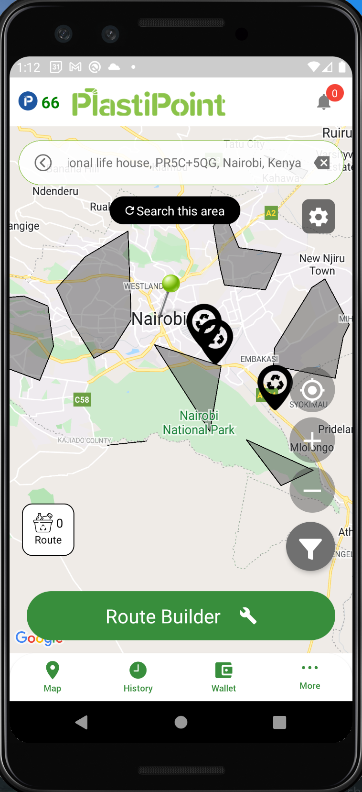
<br/>

Postgres Local Install (Docker)
----------------------
1. Download docker and docker-desktop (if preferred)
2. Install the PostgreSQL Alpine linux Docker container (see https://www.youtube.com/watch?v=RdPYA-wDhTA)
```
docker run --name postgres -e POSTGRES_PASSWORD=password -d postgres:10.10-alpine
```
3. Remote into the container
```
docker exec -it postgres /bin/sh
```
4. Change directory
```
cd /var/lib/postgresql/data/
mkdir postgis
cd postgis
```
4. Install PostGIS via this script below. I recommend copying each line of the script over to docker and making sure it completes.
*note, some steps take a while to download large files

```shell
#!/usr/bin/env bash

echo '1/8 Installing postgis....'
apk update

echo 'Installing apk dependencies...'
apk add --no-cache --virtual .build-deps \
        autoconf \
        automake \
        g++ \
        json-c-dev \
        libtool \
        libxml2-dev \
        make \
        perl \
        tiff-dev \
        curl
apk add curl-dev sqlite-dev sqlite protobuf-c-dev cmake boost-dev

echo '2/8 Installing PostGIS deps geos...'
wget http://download.osgeo.org/geos/geos-3.9.1.tar.bz2
tar xf geos-3.9.1.tar.bz2
cd geos-3.9.1
./configure
make 
make install
cd ..

echo '3/8 Installing proj...'
wget --no-check-certificate https://download.osgeo.org/proj/proj-8.1.1.tar.gz 
tar xf proj-8.1.1.tar.gz 
cd proj-8.1.1
./configure
make 
make install
cd ..

echo '4/8 Installing gdal...'
apk add linux-headers
wget http://download.osgeo.org/gdal/2.2.4/gdal-2.2.4.tar.gz
tar -xvzf gdal-2.2.4.tar.gz
cd gdal-2.2.4
./configure
make
make install
cd ..

echo '5/8 Installing Postgis...'
wget --no-check-certificate https://download.osgeo.org/postgis/source/postgis-3.1.4.tar.gz
tar xvzf postgis-3.1.4.tar.gz 
cd postgis-3.1.4
./configure
make
make install
apk add proj-dev --repository=http://dl-cdn.alpinelinux.org/alpine/edge/community
cd ..

echo 'install pgrouting extension'
wget -O pgrouting-3.1.4.tar.gz https://github.com/pgRouting/pgrouting/archive/v3.1.4.tar.gz
tar xvfz pgrouting-3.1.4.tar.gz
cd pgrouting-3.1.4
mkdir build
cd build
cmake  ..
make
make install
cd ../..

echo '6/8 Enable extension in Postgres...'
psql -U postgres postgres
create extension postgis;
select POSTGIS_VERSION();
CREATE EXTENSION postgis_topology;
CREATE EXTENSION postgis_raster;
CREATE EXTENSION hstore;
CREATE EXTENSION pgrouting;
SET postgis.gdal_enabled_drivers = 'ENABLE_ALL';
psql \q


echo '6/8 install open street maps converter'
#- https://www.cybertec-postgresql.com/en/open-street-map-to-postgis-the-basics/
#- https://medium.com/swlh/getting-started-with-openstreetmap-and-postgis-6e7d0d2e3421
apk --update-cache add cmake git zlib
apk --update-cache add make 
apk --update-cache add make g++ boost-dev expat-dev bzip2-dev zlib-dev libpq 
apk --update-cache add lua5.3-dev postgresql-dev 
git clone https://github.com/openstreetmap/osm2pgsql.git
cd osm2pgsql
mkdir build && cd build
cmake ..
make
make install
osm2pgsql --version
cd ../..
# if error then we need proj4
#    apk del proj && apk del proj-dev && cd .. && rm -rf build
# Found Proj [API 6] /usr/local/lib/libproj.so

echo '7/8 Import Maps'
# Command line args https://www.mankier.com/1/osm2pgsql
#wget https://download.geofabrik.de/north-america/us-midwest-latest.osm.pbf
#wget http://download.geofabrik.de/north-america/us/texas-latest.osm.pbf
wget http://download.geofabrik.de/africa/kenya-latest.osm.pbf
#osm2pgsql -U postgres -W -d postgres -H localhost -G --slim -l  us-midwest-latest.osm.pbf
#osm2pgsql -U postgres -d postgres -H localhost -G --cache=8192 --slim --latlong --hstore-all --extra-attributes texas-latest.osm.pbf
osm2pgsql -U postgres -d postgres -H localhost -G --slim --latlong --hstore-all --extra-attributes kenya-latest.osm.pbf
psql -U postgres postgres
GRANT ALL PRIVILEGES ON ALL TABLES IN SCHEMA public TO hppoc;
GRANT ALL PRIVILEGES ON ALL SEQUENCES IN SCHEMA public TO hppoc;
psql \q

```


Install PGAdmin
--------------
1. Run
```
docker run --name PGAdminWeb -p 5050:80 \
    -e "PGADMIN_DEFAULT_EMAIL=your@email.com" \
    -e "PGADMIN_DEFAULT_PASSWORD=yourpassword" \
    -d dpage/pgadmin4
```
2. Open http://localhost:5050/browser/ and login with `your@email.com` and `yourpassword`
3. click server > add new server
4. Name > whatever , then goto "Connection Tab" 
    - Host = get ip address of postgres by running `docker inspect postgres | grep IPAddress`
    - Port = 5432
    - Username = postgres
    - Password = password
5. Once logged in you can goto the query tool to start writing sql
```
Databases > Postgres > Schemas > Public > Tables (notice planet_osm_* tables imported from Open street maps) > right click > Query Tool
```


Queries
--------

### Get water features
```sql
select osm_id, name, tags, way
from planet_osm_polygon
where planet_osm_polygon.natural like 'water' and name is not null
limit 150
```

### Query tags using hstore
```sql
select tags
from planet_osm_polygon
WHERE tags::hstore -> 'natural' = 'water' and name is not null
limit 150
```

### Get Nairobi Polygon map
```sql
select osm_id, name, way
from planet_osm_polygon
WHERE name = 'Nairobi'
limit 1
```
*To view the "way" data on a map you can open the "Geometry Viewer" by clicking on row (Data Output) > then scroll all the way over to the right and click the "eyeball" button next to the "lock" button


### Convert to GeoJson (Front end apps can overlay the GeoJSON polygons onto a map because its a common standard)
```sql
select osm_id, name, ST_AsGeoJson(way)
from planet_osm_polygon
WHERE name = 'Nairobi'
limit 1
```

### Smart Route Query
*Note, It is a super complicated query. Most of the PostGIS SQL was learned from watching this video <a href='https://www.youtube.com/watch?v=g4DgAVCmiDE' target='_blank'>https://www.youtube.com/watch?v=g4DgAVCmiDE</a> . This is a basic, unoptimized, Smart Route. The goal is to further optimize it by cross referencing more datasets (like water features, traffic data, etc...).
```sql
SET SESSION vars.region = 'Nairobi';
SET SESSION vars.num_pickups = '100';
SET SESSION vars.num_collectors = '10';

(
	WITH REGION_GEOM as (
		SELECT name, 
			osm_id,
			/* Step 2 - generate Random Points */
			ST_GeneratePoints(
				way, 
				current_setting('vars.num_pickups')::int
			) as the_geom
		FROM (
			/* Step 1 - get the polygon of a region */
			SELECT name, osm_id, way 
			FROM planet_osm_polygon 
			WHERE name = current_setting('vars.region')
      		LIMIT 1
		) as REGIONGEOM
	),

	REGION_POINTS as (
		SELECT osm_id, ST_AsText((ST_Dump(the_geom)).geom) as geom 
		FROM REGION_GEOM
	),

	ROUTE_CLUSTERS as (
		SELECT
		  kmeans_cid as cid,
		  ST_Collect(geom) as geom
		FROM (
			SELECT geom,
				/* Step 3 - Cluster using KMeans */
				ST_ClusterKMeans(
					geom, 
					current_setting('vars.num_collectors')::int
				) OVER () AS kmeans_cid
			FROM REGION_POINTS
		) as ROUTECLUSTERS
		/* Step 4 - Group by cluster id */
		GROUP BY kmeans_cid
		ORDER BY kmeans_cid
	),

	ROUTE_POLYGONS as (
		SELECT cid, 
			/* Step 7 - clip the lines to be in bounds */
        	ST_Intersection(
				ST_VoronoiPolygons(geom), 
				st_concavehull(geom, .99)::geography
			) as geom,
			/* Step 5 - Get Center Point */ 
			ST_Centroid(geom)::geography as centroid,
			/* Step 6 - Turn point data into polygons */
			ST_VoronoiPolygons(geom)::geography as vor
		FROM ROUTE_CLUSTERS
	)

	/* Step 8 - Union the points and cluster onto one neat map */
	SELECT cid, geom::geography FROM ROUTE_CLUSTERS
	UNION
	SELECT cid, geom::geography FROM ROUTE_POLYGONS
)
```

Now lets break down the "Smart Route Query" into 8 steps:

1. First, get the polygon of a region like Nairobi
```sql
SELECT name, osm_id, way 
FROM planet_osm_polygon 
WHERE name = 'Nairobi'
LIMIT 1
```
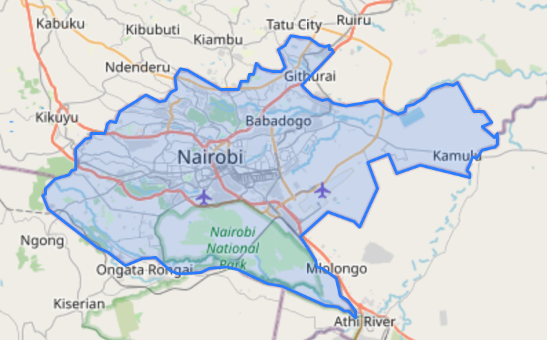

2. Next lets generate 100 Random Points within the Nairobi region using the PostGIS function ST_GeneratePoints. 
	- Docs <a href='https://postgis.net/docs/ST_GeneratePoints.html' target='_blank'>https://postgis.net/docs/ST_GeneratePoints.html</a> 
	- Video <a href="https://youtu.be/g4DgAVCmiDE?t=2432" target="_blank">https://youtu.be/g4DgAVCmiDE?t=2432</a>
	- SQL
```sql
SELECT name, 
	osm_id, 
	ST_GeneratePoints(
		way, 
		100
	) as the_geom
FROM (
    SELECT name, osm_id, way 
    FROM planet_osm_polygon 
    WHERE name = 'Nairobi'
    LIMIT 1
) as REGIONGEOM
```
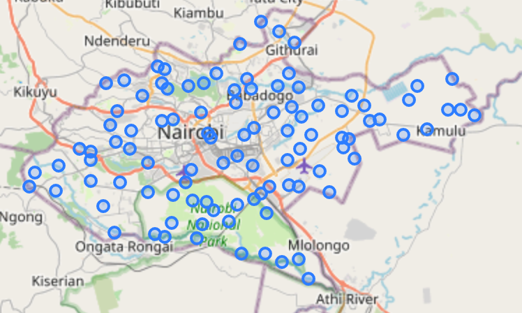
This makes the REGION_GEOM. You can save this in a temp table. 

3. Next, lets put the points into 10 clusters, representing 10 collector zones. We use the KMeans clustering algo in PostGIS (ST_ClusterKMeans)
	- Docs <a href='https://postgis.net/docs/ST_ClusterKMeans.html' target='_blank'>https://postgis.net/docs/ST_ClusterKMeans.html</a> 
	- Video <a href="https://youtu.be/g4DgAVCmiDE?t=2451" target="_blank">https://youtu.be/g4DgAVCmiDE?t=2451</a>
	- SQL
```sql
SELECT 
	ST_ClusterKMeans(
		geom, 
		10
	) OVER () AS kmeans_cid,
	geom
FROM REGION_POINTS
```
This will label each point from 0-9 representing what cluster they belong to.
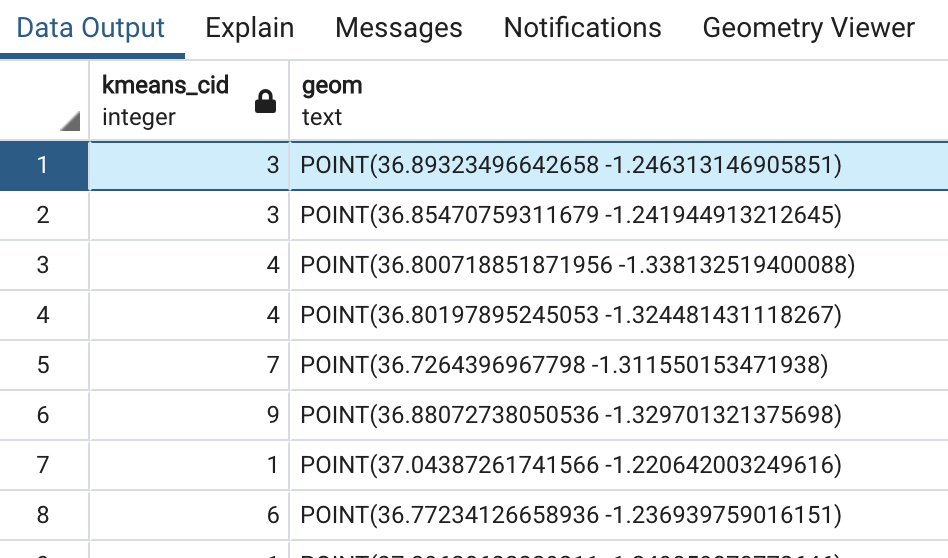
The image below is a better visual of points being subdivided into k means clusters (because I dont know how to use different colors for points in pgadmin geometry viewer)
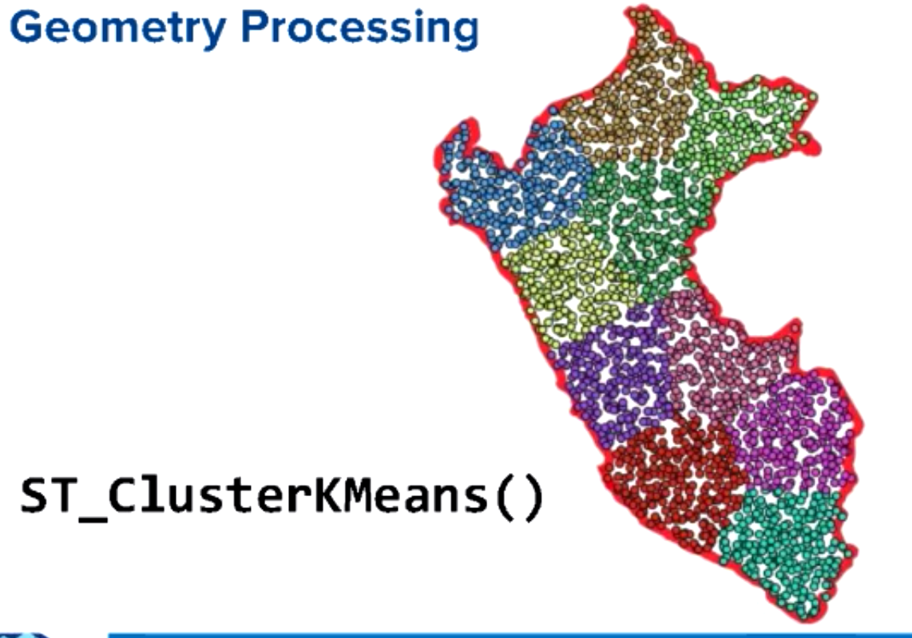

4. Now that we have all the raw data we need to group the points into each of the 10 clusters
```sql
SELECT
	kmeans_cid as cid,
	ST_Collect(geom) as geom
FROM (
	SELECT geom,
			ST_ClusterKMeans(
				geom, 
				current_setting('vars.num_collectors')::int
			) OVER () AS kmeans_cid
	FROM REGION_POINTS
) as ROUTECLUSTERS
GROUP BY kmeans_cid
ORDER BY kmeans_cid
```
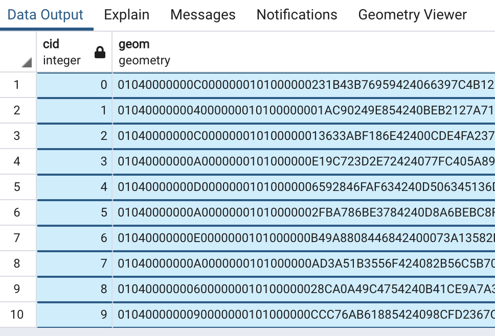
We can save this data into the ROUTE_CLUSTERS temp table.

5. Next we need to get the center point of each of the 10 clusters (for drawing boundaries)
	- Docs <a href='https://postgis.net/docs/ST_Centroid.html' target='_blank'>https://postgis.net/docs/ST_Centroid.html</a> 
	- Video <a href="https://youtu.be/g4DgAVCmiDE?t=2466" target="_blank">https://youtu.be/g4DgAVCmiDE?t=2466</a>
	- SQL
```sql
SELECT 
	cid, 
	ST_Centroid(geom)::geography as centroid
FROM ROUTE_CLUSTERS
```
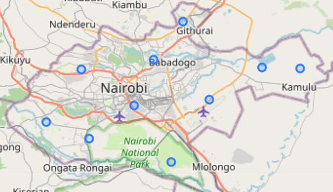

6. We also need to draw the boundary squares using ST_VoronoiPolygons. This algo is good for turning points data into polygon data (this one looks messy but we need this data to use as an input to clip in the next step)
	- Docs <a href='https://postgis.net/docs/ST_VoronoiPolygons.html' target='_blank'>https://postgis.net/docs/ST_VoronoiPolygons.html</a> 
	- Video <a href="https://youtu.be/g4DgAVCmiDE?t=2476" target="_blank">https://youtu.be/g4DgAVCmiDE?t=2476</a>
	- SQL
```sql
SELECT 
	cid, 
	ST_VoronoiPolygons(geom)::geography as vor
FROM ROUTE_CLUSTERS
```
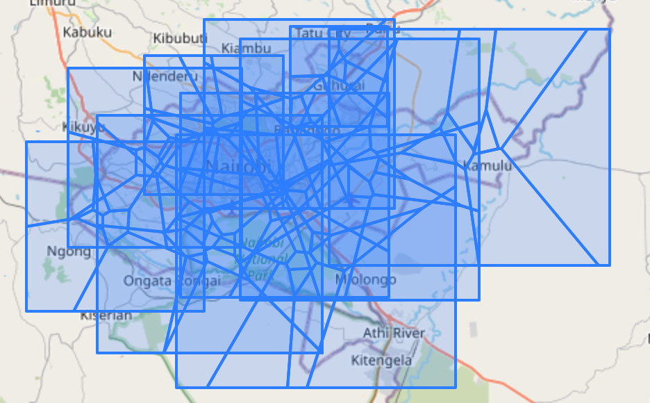
This image above looks crowed with all 10 clusters. Here is what just one clusters Voronoi Polygon looks like:
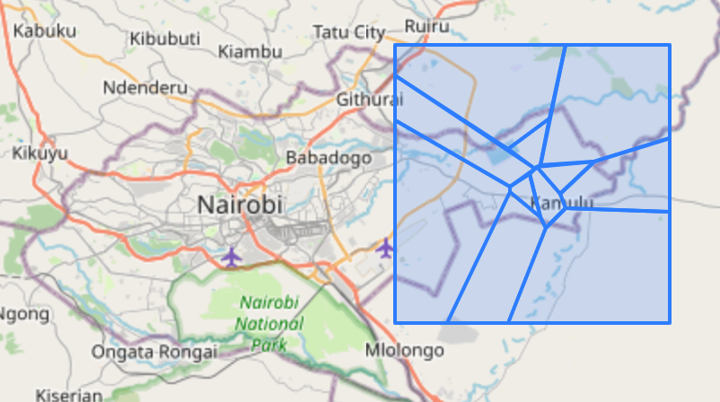

7. Clip the lines to be in bounds of our 10 cluster region polygons using intersects (now its starting to look good!)
	- Docs <a href='https://postgis.net/docs/ST_Intersection.html' target='_blank'>https://postgis.net/docs/ST_Intersection.html</a> 
	- Video <a href="https://youtu.be/g4DgAVCmiDE?t=2486" target="_blank">https://youtu.be/g4DgAVCmiDE?t=2486</a>
	- SQL
```sql 
SELECT 
	cid, 
	ST_Intersection(
		ST_VoronoiPolygons(geom), 
		ST_ConcaveHull(geom, .99)::geography
	) as geom
FROM ROUTE_CLUSTERS
```
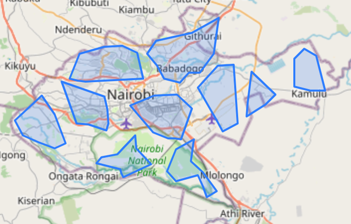
We can save this into the temp table ROUTE_POLYGONS.

8. The last step is to union the clusters and points onto one neat map. 
```sql
SELECT cid, geom::geography FROM ROUTE_CLUSTERS
UNION
SELECT cid, geom::geography FROM ROUTE_POLYGONS
```
And thats the Smart Route!
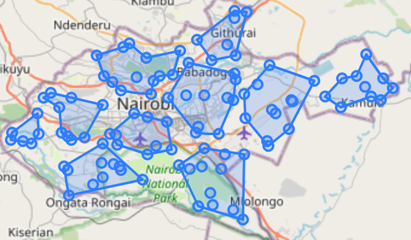


More queries here: <a href="https://github.com/opencircular/opencircular/blob/master/src/blockchain/hyperledger/smartcontract.readme.md#query-something" target="_blank">https://github.com/opencircular/opencircular/blob/master/src/blockchain/hyperledger/smartcontract.readme.md#query-something</a>
