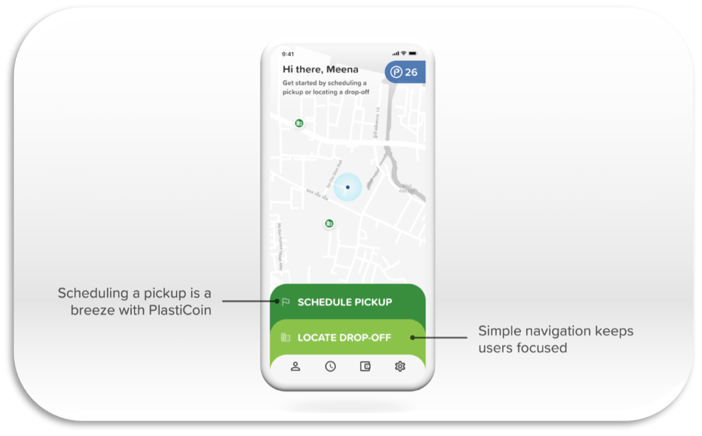
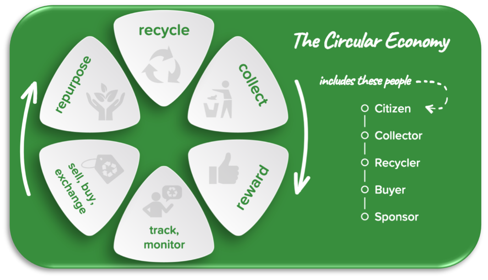

Intro
-----
Plastic manufacturers are feeling pressure and seeing a loss in sales due to the negative global
sentiment of one-time use plastics, such as straws. New hybrid materials are being invented that are
hard to mechanically recycle in our current system. Littering is a huge problem, but there is little
incentive for the average consumer to recycle. Existing recycling centers have little incentive to retool
and handle new hybrid materials. Third-world countries are causing plastic leakage into the ocean due
to lack of municipal recycling programs. A new system needs to be created to solve these global
problems.

In opening, here is a quote from the book `“The Circular Economy: A wealth of Flows”` by Ken Webster:

> “Information technology potentially allows the tools of the economy, the medium-and-long-life durable
products, to become the basis for a market in the services they provide, rather than just selling the
product itself. [...] Information technology allows easy administration and the billing for a thousand small
transactions. It even allows the creation of designer currencies to reach the parts of the economy not
served by the conventional monocultures.”

Solution Proposal
---------------
We propose a solution called PlastiCoin*. PlastiCoin solves the recycling and economic incentive
problem for both consumers and recycle centers and introduces an Uber-like recycling pickup program
fueled by rewards. PlastiCoin embraces the techniques used in Silicon Valley and startups. It also
introduces the Open Circular Network to coordinate the global recycling system. (*PlastiCoin is the
current working name but will most likely change to include all material)

To sum it up, the idea is simple, you need to pay people to do the right thing...to clean, sort, and recycle.
Economic markets need to be created for recycled plastic to make the material valuable. Companies and
entrepreneurs will emerge to create the circular economy for plastic if an open network is available.
PlastiCoin and the Open Circular Network aim to create the base data sharing network and applications
to enable the circular economy globally. It will be the supply chain, logistics and data network to connect
the circular economy. Figure 1 shows a high-level view of what the material circular economy looks like,
and the players involved.

Videos
-------

Mr. Green Kenya Pilot
<iframe width="560" height="315" src="https://www.youtube.com/embed/yn-XbeaCt7c" title="YouTube video player" frameborder="0" allow="accelerometer; autoplay; clipboard-write; encrypted-media; gyroscope; picture-in-picture" allowfullscreen></iframe>

3 Min Teaser Video
<iframe width="560" height="315" src="https://www.youtube.com/embed/Z7pa2h9yI7M" title="YouTube video player" frameborder="0" allow="accelerometer; autoplay; clipboard-write; encrypted-media; gyroscope; picture-in-picture" allowfullscreen></iframe>

App Walkthu Video
<iframe width="560" height="315" src="https://www.youtube.com/embed/F4EY7GAqyhE" title="YouTube video player" frameborder="0" allow="accelerometer; autoplay; clipboard-write; encrypted-media; gyroscope; picture-in-picture" allowfullscreen></iframe>

