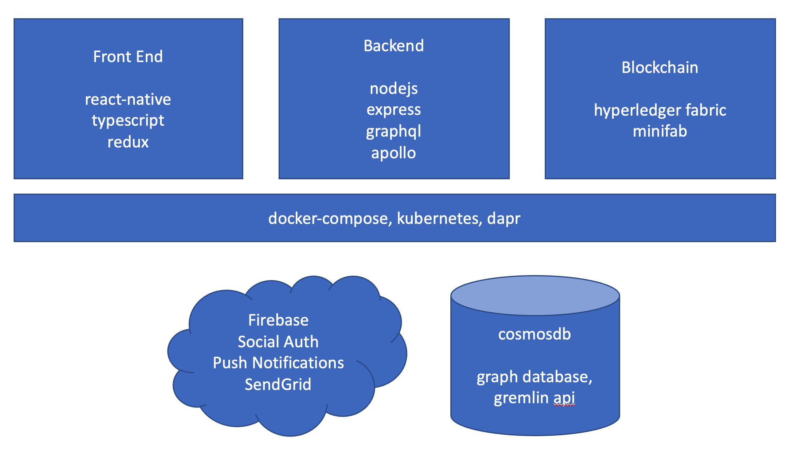

Quick Start
===========

Tech Stack
---------


Install Dependencies
----------------

First install the prerequisites and copy the .env files as documented [here](#Install-Dependencies)

Start the backend
----------------
1. `cd src/server/services`
2. `npm i`
3. `npm run start`
4. Wait for the gateway to start. you should see this message 
```
🚀 Gateway ready at http://localhost:3999/graphql`.
```
  - *NOTE It takes about 10 seconds to load while it launches a few services on different ports and the gateway. It uses nodemon to monitor changes file changes. It uses Docker containers to run Dapr Microservices for pub/sub/stateful/redis/service invoke/gRPC
5. Next open a new terminal tab and run dapr `npm run dapr`
6. If you are debugging you can attach the vscode debugger 

```
debug tab in vsode > choose `Debug PlastiCoin (services)` > green play button
```
http://localhost:3999/graphql - This should boot the GraphQL explorer (gateway.ts) and you need a token to query the api see [GraphQL Explorer docs](#GraphQL-Explorer)


Start the Front End
------------------

#### Android

1. `cd src/client/react-native`
2. `npm i`
3. make sure an emulator is running or preferably a device is plugged
4. If this is the first time running I recommend opening the android project in android studio 
to let gradle index and build automatically. Thereafter, you should be able to simply `npm run android` without android studio.
    - `src/client/react-native/android`
5. `npm run android` (make sure this runs jetifier)
6. In a new tab watch for typescipt errors `npm run watch`


#### iOS

1. `cd src/client/react-native`
2. `npm i`
3. `cd ios && pod install && cd ..` 
4. Open the ios project with xcode
  - `open ./ios/plasticoin.xcworkspace`
5. make sure your mac has a developer certificate with an Apple developer account. Here is a good resource on how to do this: https://ionicframework.com/docs/appflow/package/credentials#ios-setup
6. Configure your apple developer cert. This is to ensure you have the provisioning profile that links your ios phone to your develoepr cert to the app ID com.dow.plasticoin. It should look similar to this:

7. fix an Auth package, as noted here: https://github.com/FormidableLabs/react-native-app-auth/issues/296#issuecomment-525400686
    - Make sure the pod files are installed for the package AppAuth `pod install`
    - Open this file `src/ios/Pods/AppAuth/Source/OIDAuthorizationService.m`
    - Comment out this block of code on line 124
    ```js
      // rejects URLs that don't match redirect (these may be completely unrelated to the authorization)
      // if (![self shouldHandleURL:URL]) {
      //  return NO;
      // }
    ```
7. Run the app on the simulator
    - you might need to clean the project `Product > clean build folder`

Start the Blockchain
-------------------