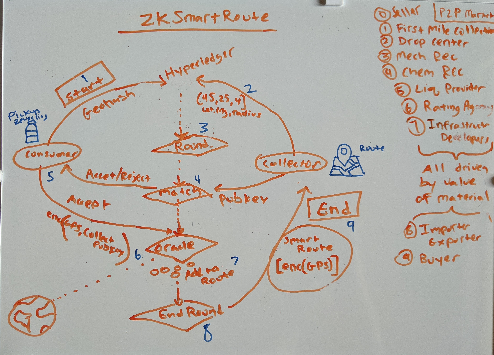
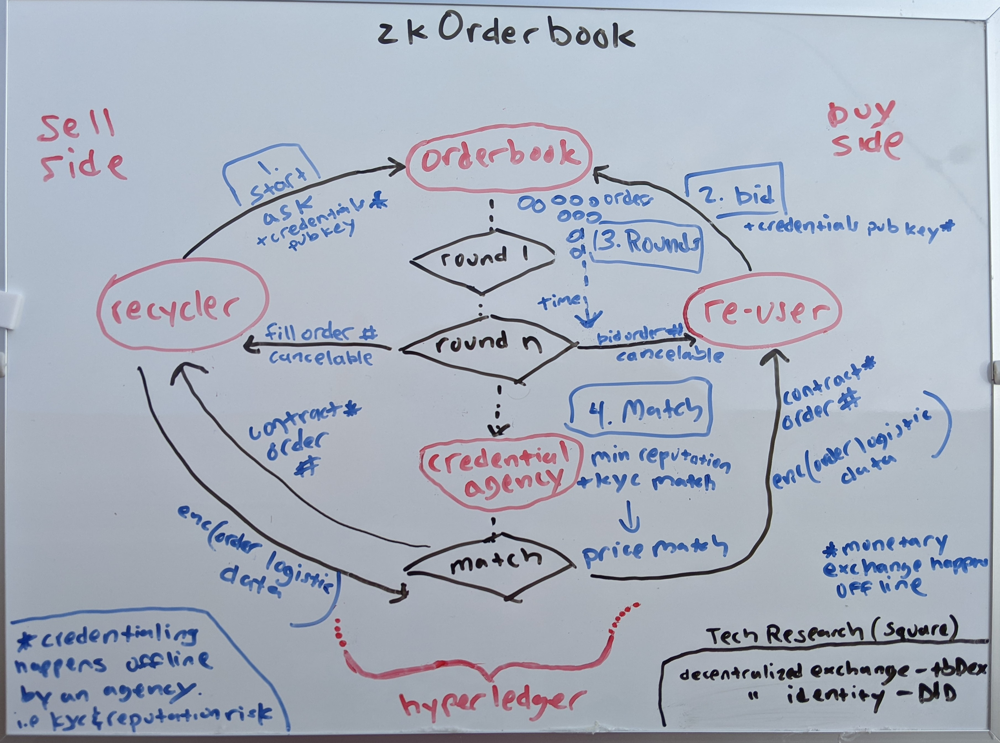

Open Circular Network
====================

The Open Circular Network handles:
- Tracking and incentivising the flow of materials 
- Matchmaking: matching consumers with recycling to collectors/recycling centers (Smart Route Matchmaking Protocol)

Legacy System
===============
In the past, legacy systems were decent at tracking large flows of material via shipping ports and warehouses. Companies, like Amazon, are pretty good at "the last mile" delivery. They excel at efficient warehouse management and placement. Amazon is really good at predicting what products a consumer will want to buy. This is becuase they sit on a gold mine of data. They are a data monopoly. In other industries, if you are a company that needs to ship an item you typically call up a central company. The central company aggregates your shipping request with many other companies. This operates on many proprietary complex systems and EDI networks. Eventually when the size of the shipment reached a certain threshhold it was shipped. This resulted in a monopoly of import/export data and processes. 

The problem with this legacy system is that it does not include the local consumer. It does not include the "first mile"! The existing system does not stimulate local entrepreneurial businesses to organically form. It is not a very conductive environment for a "Circular Economy" to thrive.  The local consumer/entrepenuer does not have access to the central database. He is usually part of an informal system, especially in regards to a recycled material circular economy. In this system there is no incentive to enable a flow of material from the local consumers to larger aggregation points, then to recycling centers, and finally to global ports (if needed...keep it local if possible). It also lead to cartels running centralized facilies and data platforms. Over time the system becomes ineffienct, expensive and ran by monopolies See [Chaos Theory](https://podcasts.google.com/feed/aHR0cHM6Ly9taXNlcy5vcmcvaXR1bmVzLzQxMA) by Robery Murphy.

Future System
==============
The solution is simple. Don't store all that data on a database system that is owned by one company. We need an open system. Instead, save that data on a distributed ledger that is ran by many companies and individuals in regions all around the world. The network can be broken up into regions using channels. The channel regions can be ran by anyone (informal/formal, gov/business/NGO/individual). 

Voluntary companies will emerge to fufill the needs of the network, such as the role of Insurance Agencies, Rating Agenices and Logistics Companies. These companies will emerge because of several factors including, monetary, entrepenuerial and "license to operate" incentives. These companies will allow the network to scale globally, organically and sustain for decades to come. I suspect smaller more altruistic organisations will form as well (posssibly out of governmnet initiatives), but I do not believe they will scale the network or solve the problem globally for any meaningful depth of time. 

The Open Circular Network tries to solve this problem. The enabling technology is the "Smart Route Matchmaking Protocol". It can be broken down into the following components running as smart contracts on a distributed ledger:

Smart Route Matchmaking Protocol
================================
The Smart Route Matching making Protocol is the most important component on the network. Here we can get into the details of the smart contracts we started to talk about above. The protocol consists of a few smart contracts, a matchmaking engine, and a distributed ledger to make sure routes are fairly created and distributed to collectors on the network. The routes must be efficient and economical. The routes cannot be created by one central party to enforce a fair open system without bias. The only way to achieve this with an open non-custodial market. 
The figure below shows a high-level step by step process flow of the protocol:

<iframe width="560" height="315" src="https://www.youtube.com/embed/wmatfaX1mHk" title="YouTube video player" frameborder="0" allow="accelerometer; autoplay; clipboard-write; encrypted-media; gyroscope; picture-in-picture" allowfullscreen></iframe>

Components of the Smart Route Matchmaking Protocol
==================================================
- Distributed Ledger
    - Smart Contracts
    - Channels
    - Peers
- Smart Contracts
    - Request Orderbook
    - Smart Route Queue
    - Tracing Ledger
    - Rewards Balance
    - Collectors Pool
    - Recycling Center Exchange Rates
    - Reputation Ratings
- Oracle
    - The Oracle pulls real life data into the smart contract
        - Traffic API
        - Directions/Mapping API
        - AI to predict the best routes???

Next, let's go over the workflow of a typical recycling request.

Workflow
==============

(1) Request 
------------

A pickup request is entered into the “Request Orderbook” by the consumer with recyclables as either a Market order or Bid order.

- Market Order
    - A market order simply takes the average fee and value split created by the matchmaker oracle. 
- Bid Order
    - A Bid order allows the consumers to bid and get a cut of value of the material. 
    
For instance, you might live in a region that has 2 service providers, (1) Company A, who charges a fee of $1 and gives you a value split of 0%; or (2) Company B who charges no fee and gives a 1% split to the consumer. An entrepreneur in the region might see a market opportunity to undercut the competition and create a better cheaper company than Company A and Company B. 

**Open Market**

Since it’s an open market, they have the choice to create Company C and cut the pickup fees to 0 and offer a value split of 5% to the consumer. Market theory suggests the consumer would pick the better deal! Also, imagine if competition grows and there are many collectors on the network. In this situation a Bid order might offer a better return for the consumer. A consumer could place a bid to be paid 6% with no pickup fees to the Recycling Orderbook. For our example, let’s assume this is the happy path and the pickup request is placed in orderbook (depicted by the red (1) in the figure above). This would update the orderStatus to “offer” with an expiration date of 2 weeks for example. Any collector on the network can accept this offer if it is economically feasible and time permitting for them. 

(2) Offer Queue
---------------
When the orderStatus is updated to “offer” the pickupLocation, txID, and expiration date are added to the “Smart Route Queue”. This does not mean it is assigned to a specific collector yet, any collector can swoop in and offer a better deal. The status does not change until the expiration date is met in this offer round (typically one week, but can vary by regional demands). 

(3) Rounds 
----------

How do we match the pickup requests to a collector and create a Smart Route? The answer is you split the requests into rounds that occur over a set amount of time. Only the requests with the highest fees for the collector will make it into the current round. The less desireable fees are bumped into a later round.  The following factors determine if an request is accepted into an offer round:
- fee
- expiration date
- external factors (oracle)
    - directions api
        - route efficiency score (traveling salesmen)
    - reputation score
    

The offer is pending until the “Smart Route Protocol” adds it to a route. The smart route protocol uses a combination of the MATCH matchmaking protocol and traveling salesmen’s algorithms to efficiently add pickupLocations to a Smart route based on a policy. The policy contains constraints such as collector capacity, vehicle, regional constraints, price and reputation score* (*reputation score can get complex and biased, so more research needs to be done). The “Smart Route Protocol” also uses input data from the “Collector Fee Chart” and “Recycling Center Exchange Rates” to help calculate the most efficient route. 

**Data Privacy**
How do we aggreate GPS locations into a route if the data is encrypted?
**Front Running** How do we prevent front running to prevent a bad peer from stealing a pickup request before the round is complete?
1. We could use a feature in Hyperledger Fabric called "Private Collections" to encrypt the GPS data in the channel to only the Oracle. The Oracle could be setup as a separate organization on the channel. The Oracle would be the only organization that would decrypt the data and create the smart route. The only downside to this approach is somebody would have to hold the key to the Oracle organization.
2. We could use homomorphic encryption to calculate the encrypted distance between encrypted GPS locations and get the encrypted answer. *More research

If an expiration date on a request is met the user can pay the market fee to make it into the next round, or simply wait to see if the request is fulfilled in the subsequent round. 

**Bitcoin Mempool Comparison**

The "Smart Route Matchmaking protocol" is similar how the Bitcoin protocol works in regards to how a transactions makes it into the mempool, and evetnually into a block. Each block in Bitcoin represents 1 round, and each round completes about every 10 minutes. When a transaction is transmitted into the next round it is added into the mempool (queue). Each block (1-2MB) can fit about 2,000 transactions in it. Bitcoin is an open market so the transactions with the highest fee's are added first. If a user does not pay a high enough fee on his transaction then he is bumped back in line to a later block. See https://mempool.space/ for a visualization of this concept.

(4) Match 
----------
When all the constraints are met and we reach the end of the round, the Smart Route is given to the collector by the Matchmaker Oracle Engine and the status of the pickup in the Orderbook is changed to “Reserved”. 

The collector receives a notification that he has a new route. He should accept (or take a reputation hit reverting the status of the route).  When accepted, the status of the request in the Orderbook changes to “Accepted”. At this point the private data fields, pickupLocation and userId are revealed to the only the collector using public key cryptography. The collector goes along his route and the Tracing Ledger is updated after each pickup using the collector’s digital signature.

(5) Reward
-----------
Rewards are given based on the pre-agreed upon Collector fee chart. The token balance is updated in the Rewards Balance ledger. (a cryptocurrency like Bitcoin could be used instead of a worthless token or proprietary points system)  

At the end, each party in the process is awarded Reputation points based on rating and computed fields, like route completions.

zkSmartRoute - Zero Knowledge Smart Route
======================================
We need the ability to build an accurate smart route without leaking sensative user location data. In the Airbnb app you can browse for a property to rent but you do not get the exact location of the home. It uses an approximate location based on neighborhood for user privacy. This solves user privacy issues as well as front running (bribing the owner out of band and cutting in line).

In the zero knowledge smart route protocol we mask the GPS location using a concept called "Differential Privacy" and "Secure Multiparty Compute"
- "Differential Privacy": Data privacy via noise on large datasets 
    - See [https://www.youtube.com/watch?v=NRf6sUk1bv0](https://www.youtube.com/watch?v=NRf6sUk1bv0){:target="_blank"}  
- "Secure Multi-Party Compute": Masking private data while still allowing computations. 
    - [https://www.youtube.com/watch?v=l25jcolQW6Q](https://www.youtube.com/watch?v=l25jcolQW6Q){:target="_blank"} (2 min intro) 
    - [https://www.youtube.com/watch?v=P2MmO458xu4](https://www.youtube.com/watch?v=P2MmO458xu4){:target="_blank"} (30 min Boston University Lecture)

Here is the workflow of how a consumers material is picked up and the collector recieves a smart route.

1. (Consumer) The client will compute and send the following to the Orderbook:
    - geohash of the pickup location region
    - encrypt the actual location with the users public key
    - compute a maskedGPS, i.e a random GPS location within a few blocks of the real location using differential compute.
    - expiration date of the request (when you want the request picked up by)
    - pass this data to the "Request Orderbook" smart contract to the specific channel in your region.
    - financial data
        - bid or market split
            - market is average value split paid and computed in region based on what neighbors paid
            - bid is not garunteed 
        - requested value split perentage
        - max fee willing to pay
2. (Collector) Sends [lat,lng,rad] to the collector pool with his days of availability
3. Time passes in the round and many pickup requests are gathered in the Orderbook. 
4. The Oracle is constantly calculating and computing the most effient route each hour based on the following inputs:
    - How many nodes in the region?
    - How close is a node to the expiration date?
    - How many collectors are in the pool for the region?
    - Are the financial threshholds within range?
    - What real world event may effect delays?
        - traffic?
        - road closures?
        - weather?
    - Eventually a MATCH is made for the SMART ROUTE...for example 50 pickups for collector A.
5. After the match is made the oracle sends out a message to everyone in the route and they can accept or reject (within an expiration date).
    - The message contains the:
        - fee amount (if any)
        - the value split (if any)
        - the date of the pickup
        - the public key of the collector
    - if accept
        - the client encrypts his gps location to the collectors pubkey (only the collector can decrypt this...not even the oracle or sysadmins on the hyperledger network)
    - if deny
        - a deny signal is sent back to the oracle with a reason why (to help the oracle better understand in the future for optimzations)
6. The oracle waits for X percetnage of the 50 pickup messages to come back
7. After the rounds hits the expiration date
    - success threshold
        - each pickup is added to the route
        - the smart route is gernetated
        - the round is ended 
    - fail threshhold
        - the oracle waits for more routes to fullfill the request and handles messaging back to the consumer
8. The smart route is given to the collector with the encrypted pickup locations
9. The collector accepts the smart route and decrypts all the pickup locations. He can go ahead and communicate with the collectors out of band and collect within the SLA. He taps into the reputation system. 

zkReputationSystem
==================
We need a system to rank the quailty of collectors without revealing personal data. We need non-objective indicators.

- Hashed Public Key
- How old is the public key?
- Non-objective indicators
    - has collector picked up the materials?
    - did the item arrive at the drop center?
    - was money exchanged?
    - how many routes has the collector completed total?
    - days worked streak?
        - are you a casual collector?
        - do you collect often?
    - fee rates
        - do you charge too much?
- tbDEX - Decentralized Identity and Verificable Credentials https://tbdex.io/whitepaper.pdf 
- Ion - Verifiable Credential and DID open data network incubated at Microsoft https://identity.foundation/ion/

zkOrderbook
===========

Further Reading
===============

The above process flow is an over-simplification of the protocol. It needs to be tweaked and tested in the real life in many regions around the world. Routes needs to be optimized for real world conditions and traffic. 

Read more on page 34 of the Greenpaper in the section titled "Smart Route Matchmaking Protocol"

