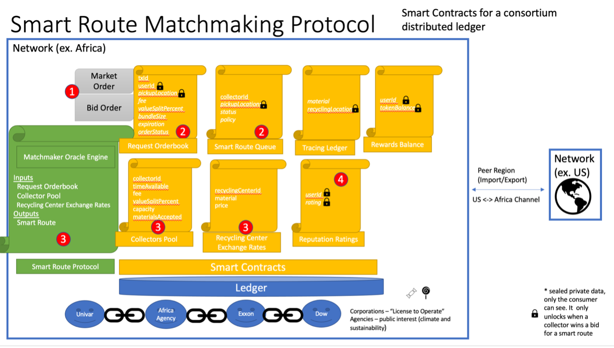

Open Circular Network
====================

The Open Circular Network handles:
- Tracking and incentivising the flow of materials 
- Matchmaking: matching consumers with recycling to collectors/recycling centers (Smart Route Matchmaking Protocol)

Legacy System
-------------
In the past, legacy systems were okay at tracking large flows of material via shipping ports. If you are a company that needs to move an item you typically call up a central company. The central company aggregates your shipping request with many other companies. Eventually when the size of the shipment reached a certain threshhold it was shipped. This resulted in a monopoly of import/export data. The problem with this system is that it does not include the local consumer and does not stimulate local entrepreneurial businesses to organically form. It is not a very conductive environment for a Circular Economy to thrive.  The local consumer does not have access to this central database. He is usually part of an informal system, especially in regards to a recycled material circular economy. In this system there is no incentive to enable a flow of material from the local consumers to larger aggregation points, then to recycling centers, finally to global ports (if needed...keep it local if possible). It also lead to cartels running centralized facilies and data platforms. 

Future System
-------------
The solution is simple. Don't store all that data on a database system that is owned by one company. Instead, save that data on a distributed ledger that is ran by many companies and individuals in regions all around the world. The network can be broken up into regions using channels. The channel regions can be ran by anyone (informal/formal, gov/business/NGO/individual). 

The Open Circular Network tries to solve this problem. The enabling technology is the "Smart Route Matchmaking Protocol". It can be broken down into the following components running as smart contracts on a distributed ledger:

- Request Orderbook
- Smart Route Queue
- Tracing Ledger
- Rewards Balance
- Collectors Pool
- Recycling Center Exchange Rates
- Reputation Ratings

Smart Route Matchmaking Protocol
------------------------------
The Smart Route Matching making Protocol is the most important component on the network. Here we can get into the details of the smart contracts we started to talk about above. The protocol consists of a few smart contracts, a matchmaking engine, and a distributed ledger to make sure routes are fairly created and distributed to collectors on the network. The routes must be efficient and economical. The routes cannot be created by one central party to enforce a fair open system without bias. The only way to achieve this with an open non-custodial market. 
The figure below shows a high-level step by step process flow of the protocol:

1. A pickup request is entered into the “Request Orderbook” by the consumer with recyclables as either a Market order or Bid order. A market order simply takes the average fee and value split created by the matchmaker oracle. For instance, you might live in a region that has 2 service providers, (1) Company A, who charges a fee of $1 and gives you a value split of 0%; or (2) Company B who charges no fee and gives a 1% split to the consumer. An entrepreneur in the region might see a market opportunity to undercut the competition and create a better cheaper company than Company A and Company B. Since it’s an open market, they have the choice to create Company C and cut the pickup fees to 0 and offer a value split of 5% to the consumer. Market theory suggests the consumer would pick the better deal! Also, imagine if competition grows and there are many collectors on the network. In this situation a Bid order might offer a better return for the consumer. A consumer could place a bid to be paid 6% with no pickup fees to the Recycling Orderbook. For our example, let’s assume this is the happy path and the pickup request is placed in orderbook (depicted by the red (1) in the figure above). This would update the orderStatus to “offer” with an expiration date of 2 weeks for example. Any collector on the network can accept this offer if it is economically feasible and time permitting for them. 
2. When the orderStatus is updated to “offer” the pickupLocation, txID, and expiration is added to the “Smart Route Queue”. This does not mean it is assigned to a specific collector yet, any collector can swoop in and offer a better deal. The status does not change until the expiration date is met in this offer round. It is pending until the “Smart Route Protocol” adds it to a route. The smart route protocol uses a combination of the MATCH matchmaking protocol and traveling salesmen’s algorithms to efficiently add pickupLocations to a Smart route based on a policy. The policy contains constraints such as collector capacity, vehicle, regional constraints, price and reputation score* (*reputation score can get complex and biased, so more research needs to be done). The “Smart Route Protocol” also uses input data from the “Collector Fee Chart” and “Recycling Center Exchange Rates” to help calculate the most efficient route. 
3. When all the constraints are met, the Smart Route is given to the collector by the Matchmaker Oracle Engine and the status of the pickup in the Orderbook is changed to “Reserved”. 
4. The collector receives a notification that he has a new route. He should accept (or take a reputation hit reverting the status of the route).  When accepted, the status of the request in the Orderbook changes to “Accepted”. At this point the private data fields, pickupLocation and userId are revealed to the only the collector using public key cryptography. The collector goes along his route and the Tracing Ledger is updated after each pickup using the collector’s digital signature.
5. Rewards are given based on the pre-agreed upon Collector fee chart. The token balance is updated in the Rewards Balance ledger. (a cryptocurrency like Bitcoin could be used instead of a worthless token or proprietary points system)  
6. At the end, each party in the process is awarded Reputation points based on rating and computed fields, like route completions.

The above process flow is an over-simplification of the protocol. It needs to be tweaked and tested in the real life in many regions around the world.

Read more on page 34 of the Greenpaper in the section titled "Smart Route Matchmaking Protocol"

