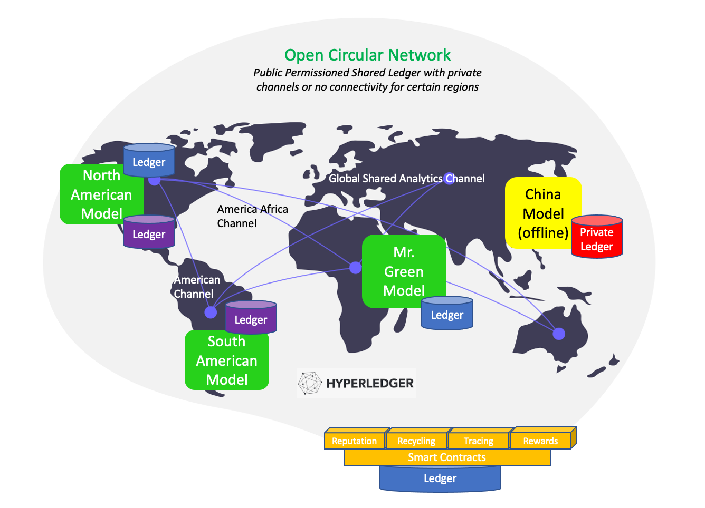

Open Circular Network
====================

The Open Circular Network handles:
- Tracking and incentivising the flow of materials 
- Matchmaking: matching consumers with recycling to collectors/recycling centers (Smart Route Matchmaking Protocol)

And it does all this without a centralized third party using a distributed ledger.

In the past legacy systems were okay at tracking large flows of material via shipping ports. This resulted in a monopoly of  import and export data. The problem with this system is that you have no data
(or incentive) to enable a flow of material from the local consumers to larger aggregation points, then to recycling centers, then to global ports (if needed. keep it local if possible). It also lead to cartels running
centralized facilies. 

The Open Circular Network and specifically the "Smart Route Matchmaking Protocol" can be broken up into the following components:
- Request Orderbook
- Smart Route Queue
- Tracing Ledger
- Rewards Balance
- Collectors Pool
- Recycling Center Exchange Rates
- Reputation Ratings

Read more in about this in the Greenpaper on page 34 titled "Smart Route Matchmaking Protocol"

The network can be broken up into regions using channels. The channel regions can be ran by anyone (informal/formal, gov/biz/individual). 

