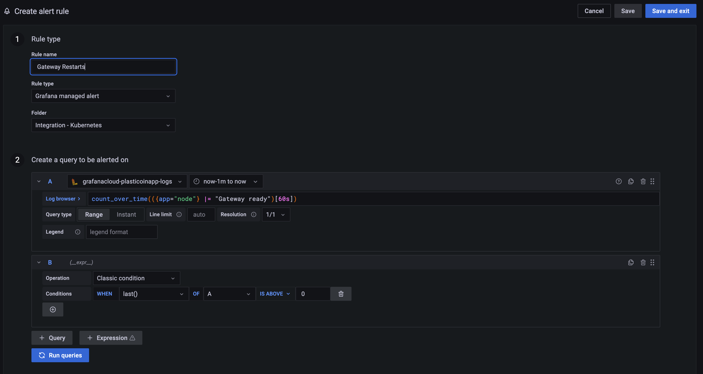
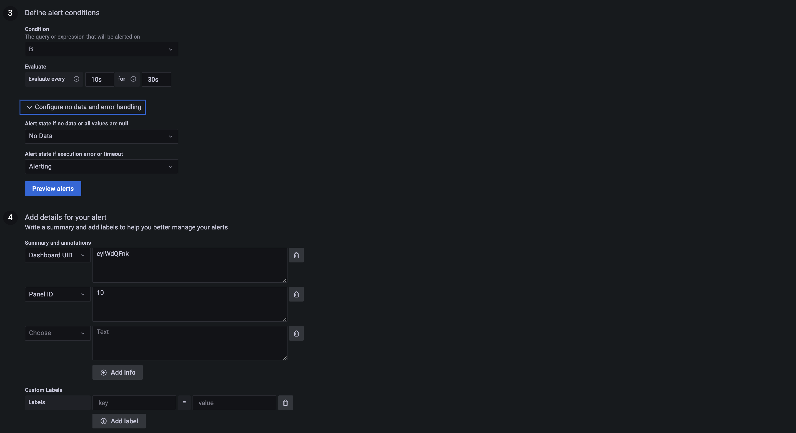

Monitoring
====================

- Grafana Dashboard https://plasticoinapp.grafana.net/d/fU-WBSqWz/plastidash?orgId=1&refresh=10s 


https://grafana.com/go/webinar/guide-grafana-cloud-exploring-kubernetes-metrics-and-logs/ 


1. Kubernetes Integration install via https://plasticoinapp.grafana.net/a/grafana-easystart-app/?page=integrations-management 
2. Configure 
3. Restart
```
kubectl rollout restart deployment/grafana-agent
```
4. Configure Kubernetes Workload Logging (Loki Agent)
https://grafana.com/docs/grafana-cloud/quickstart/agent-k8s/k8s_agent_logs/
5. Explore logs and metrics
```
https://plasticoinapp.grafana.net/goto/9ftOSQK7k?orgId=1 
```
6. Loki Query to search the plasticoin node app for a log that contains the word "gateway"
```
{app="node"} |= "gateway"
```
7. Setup alert rules
https://www.youtube.com/watch?v=GdgX46KwKqo 
```
count_over_time(({app="node"} |= "Gateway ready")[60s])
```

Grafana
=======

Alerting
--------
How to create an alert for a log? 
- The example below monitors the kubernetes workload logs (std console log out) and it searches for the app named `node`, which is our Plasticoin Backend. 
- It then searches for a log entry that containers the text `Gateway ready`. 
- It counts how many times the log appears over 60 seconds
- After 60 seconds if the count of the log entry is larger then 0 it changes the state to a `pending` alert
- If the log is pending for over 30 seconds then it changes the state to `firing`
- An email should be sent based on the notification policy (currently it emails plasticoinapp@gmail.com)






How to export all the alerting rules? Open devtools and paste the following in the console:
```
(async () => {
    function sleep(ms) {
        return new Promise(resolve => setTimeout(resolve, ms));
    }
    const resp = await fetch(`api/ruler/grafana/api/v1/rules/`);
    console.log(resp.json)
}
)();
```